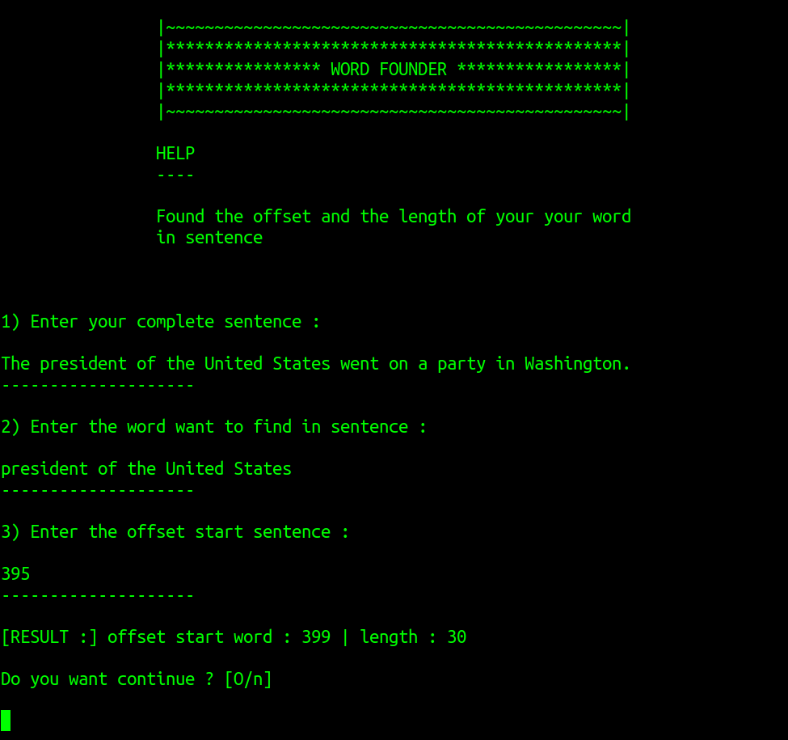

# word_founder

Small tool to help find the start of the offset of a word and its length in a very long text quickly.
Useful script to correct offset and length in auto/manual annotation of golden corpus for NER.

## Requirements 

None, just `Python 3.X`

## Launch 

`python wf.py`

## Description

## Help 

You can use the `sentence segmentation` in `service to call` in [entity-fishing](http://nerd.huma-num.fr/nerd/) to find the offset start of sentence in long text.

## Author

LucaTerre